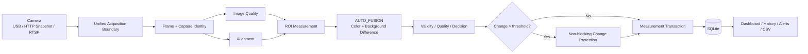

# Construction Material Monitor

> Fixed-camera construction-material remaining-volume monitoring prototype  
> **Status: Demo / PoC — not production-deployed and not operated at a customer site.**

施工現場の材料置場を固定カメラで撮影し、手動で定義した ROI（監視範囲）ごとに材料の占有面積・残量比率・増減を継続計測するためのプロトタイプです。

このプロジェクトでは、画像認識アルゴリズムだけでなく、**カメラ取得、測定の一貫性、変化確認、SQLite トランザクション、スケジューラ、再起動復旧、Web UI** まで含めて一つのシステムとして設計しました。

## Project status

| Item | Status |
|---|---|
| Development stage | Demo / PoC |
| Production deployment | **Not deployed** |
| Customer-site operation | **Not performed** |
| Real camera trial | Raspberry Pi + HTTP Snapshot を使った開発環境での試験あり |
| Automated regression | Final source archive contains **259 collected tests**; the final architecture audit records **259 / 259 PASS** |
| Long-term field validation | Not completed |

このページに記載する「結果」は、**開発環境の実データまたは自動テスト結果**です。実運用での精度・可用性・省人化効果を示すものではありません。

## Problem

材料の残量確認を人が巡回・撮影・記録する運用では、確認頻度と記録品質が担当者に依存します。そこで、次の範囲を自動化する Demo を設計しました。

- 固定カメラから定期的に画像を取得
- 1 枚の画像に複数の ROI を設定
- ROI ごとに材料の占有面積と `remaining_ratio` を計算
- 急激な変化を一度で確定せず、複数回の保護撮影で再確認
- 測定履歴・異常・Baseline を SQLite に保存
- Dashboard / 履歴 / Alert / CSV export を Web UI から利用

対象外は、材料の完全自動分類、数量（本数・m）への換算、工程表/BIM 連携などです。

## System overview

## Main engineering work

### 1. Unified camera acquisition

実カメラへの物理アクセスを camera subsystem に集約し、`MEASUREMENT`、`CHANGE_PROTECTION`、`BASELINE_REGISTRATION`、`MANUAL_REFRESH` などの目的ごとに同じ acquisition boundary を通す構成にしました。

UI の通常表示は共有済みフレームを読むだけにし、ページ遷移やタイマーが不要な撮影を発生させないようにしています。

### 2. Remaining と confidence の分離

開発初期には材料が減るほど detector の一致度が下がり、**実際の材料量の変化そのものが confidence を下げる**問題がありました。

最終版では、残量を business quantity、confidence を measurement quality として分離し、AUTO_FUSION の detector agreement も可変サイズの IoU ではなく **Baseline の固定 support 上の agreement** を使うように変更しました。

### 3. Non-blocking change protection

前回正式値から **5 percentage points を超える変化**が出た場合、即時採用しません。既定では 5 分間隔で追加サンプルを取り、一時遮蔽なのか安定した変化なのかを状態機械で判定します。

保護中に `sleep(5 min)` して worker を占有する方式は使わず、`next_due_at` を持つ durable state と scheduler job に分離しています。

### 4. Transaction / provenance design

正式 measurement は `measurement_id`、`run_id`、`frame_id`、`captured_at` を持ち、測定値がどの撮影フレーム由来か追跡できる設計です。

Baseline、measurement run、protection state には SQLite の transaction / unique index / trigger を使い、Python の呼び出し順だけに整合性を依存させないようにしました。

### 5. Bounded scheduling

複数カメラを想定し、worker 数と pending queue を有界化しています。`WAITING / QUEUED / RUNNING` を分け、処理が遅れた後に過去分を一気に catch-up する burst を発生させない設計です。

## Architecture Invariants

最終リファクタでは、今後の変更で再び同じ不整合を作らないため、8 個の Architecture Invariants をコード・DB・テストのガードレールとして固定しました。

| ID | Invariant |
|---|---|
| AI-01 | Measurement Atomic Identity |
| AI-02 | Single Acquisition Boundary |
| AI-03 | Protection Single Ownership |
| AI-04 | Commit Before Publish |
| AI-05 | Atomic Baseline Registration |
| AI-06 | Remaining / Confidence Orthogonality |
| AI-07 | Bounded Scheduling |
| AI-08 | Frame Provenance |

詳細: [System Architecture](docs/architecture.md)

## Technology

- Python 3.10–3.12
- FastAPI / Uvicorn
- OpenCV / NumPy
- SQLite
- HTML / CSS / JavaScript
- Raspberry Pi camera + HTTP Snapshot
- Optional YOLO segmentation compatibility
- pytest

## Selected source code

The portfolio includes selected excerpts from the final source archive so the architecture can be reviewed against real implementation rather than documentation alone.

- [Code examples](code-examples/)
- [AUTO_FUSION detector](code-examples/auto_fusion_detector.py)
- [Measurement transaction boundary](code-examples/measurement_transaction_excerpt.py)
- [Change-protection state machine](code-examples/protection_state_machine.py)
- [Bounded scheduler](code-examples/bounded_scheduler_excerpt.py)
- [SQLite architecture guards](code-examples/database_guards.sql)
- [Measurement semantics regression tests](code-examples/measurement_semantics_tests.py)

These are selected real source excerpts. The full application repository is not published because it contains project-specific configuration, UI and operational details that are unnecessary for portfolio review.

## Evidence included in this portfolio

このリポジトリには、架空の成果値ではなく、開発中に取得したデータの一部を匿名化して掲載しています。

- [Development measurement sample](evidence/measurements-development-sample.csv)
- [Baseline metrics](evidence/baseline-metrics.json)
- [PoC / evidence notes](docs/poc-evidence.md)

生のカメラ設定、ログ、SQLite DB、撮影画像一式は公開していません。開発環境のホスト名や背景に写る社内情報など、作品説明に不要な情報を含むためです。

## Documents

- [Project summary](PROJECT_SUMMARY.md)
- [System architecture](docs/architecture.md)
- [Vision & measurement](docs/vision-and-measurement.md)
- [Engineering evolution](docs/engineering-evolution.md)
- [PoC & evidence](docs/poc-evidence.md)
- [Limitations & next steps](docs/limitations.md)

---

**Development period:** 2026  
**Role:** system design, computer vision, backend, frontend integration, Raspberry Pi camera PoC, testing and architecture refactoring
