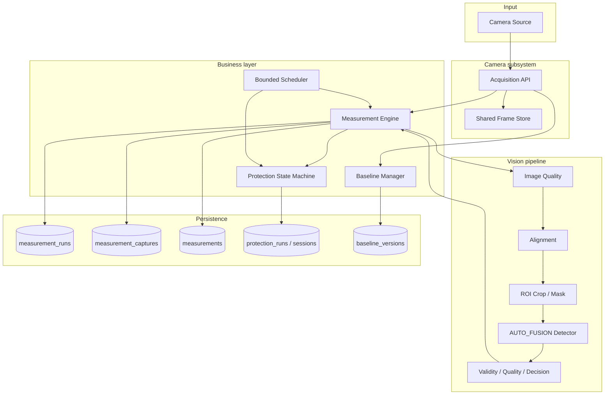
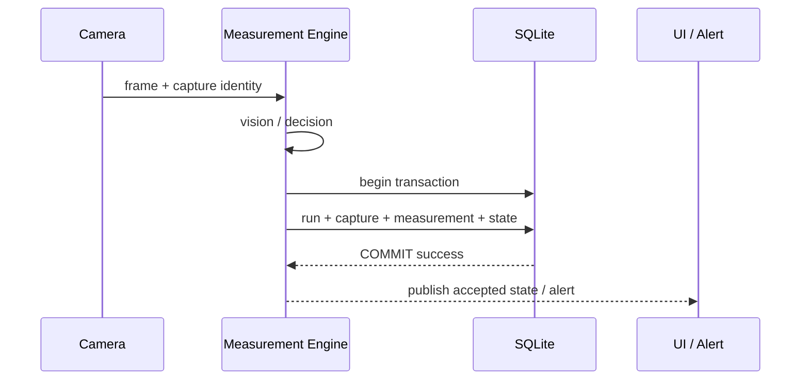

# System Architecture

## 1. Design goal

このプロトタイプでは、画像処理の精度だけでなく、**「正式な測定値が何を根拠に成立したかを後から説明できること」**を重要な設計条件にしました。



## 2. Single acquisition boundary

物理 I/O は camera layer に閉じ込め、core / API 層から `source.read()`、HTTP snapshot、USB capture を直接呼ばない構造です。

Acquisition の purpose には、実装上次の区分があります。

- `MEASUREMENT`
- `CHANGE_PROTECTION`
- `BASELINE_REGISTRATION`
- `ROI_VALIDATION`
- `CAMERA_VALIDATION`
- `MANUAL_REFRESH`
- `UI_PREVIEW`

これにより、正式測定と UI 操作が同じカメラを無制御に取り合う状態を防ぎます。

## 3. Measurement identity and provenance

正式測定は単なる `remaining_ratio` の値ではなく、次の identity を持つ record として扱います。

```text
measurement_id
  ├─ run_id
  ├─ frame_id
  ├─ captured_at
  ├─ remaining_ratio
  ├─ confidence
  ├─ validity
  ├─ quality_status
  └─ decision_status
```

Dashboard の current value も同じ accepted measurement row から構成し、`remaining` は前回正式値、`confidence` は最新試行、といった cross-row stitching を禁止しています。

## 4. Commit before publish



DB write が失敗した measurement を UI や alert が先に見てしまうと、外部から見た状態と durable state が食い違います。そのため publish は commit 後に限定しています。

## 5. Protection ownership

Protection は SQLite の durable state を authority とし、scheduler job や in-memory object を business state の正としません。

- 同一 project / camera に ACTIVE owner は 1 個だけ
- `state_version` による stale update 防止
- restart 時は SQLite から scheduler projection を再構築
- stop / shutdown 時は active session を cancel

## 6. Bounded scheduler

設定例では `max_workers = 4`、`max_queued = 4` とし、無制限 submit をしません。

```text
WAITING -> QUEUED -> RUNNING -> WAITING
```

次回時刻は完了基準で更新し、長時間処理の後に過去分を一気に補走する catch-up burst を避けています。Startup も camera order に基づいて 0 / 2 / 4 / ... 秒の stagger を入れます。

## 7. Architecture Invariants

| ID | Rule | Enforcement examples |
|---|---|---|
| AI-01 | Measurement Atomic Identity | Repository/API mapping + DB guards + tests |
| AI-02 | Single Acquisition Boundary | Camera subsystem only + static/regression tests |
| AI-03 | Protection Single Ownership | partial unique index + state version + restart tests |
| AI-04 | Commit Before Publish | transaction boundary + COMMIT-failure tests |
| AI-05 | Atomic Baseline Registration | staged filesystem + DB transaction + cleanup |
| AI-06 | Remaining / Confidence Orthogonality | semantic separation + quantity-neutral tests |
| AI-07 | Bounded Scheduling | worker/queue bounds + no catch-up tests |
| AI-08 | Frame Provenance | run/frame/capture identity + SQLite triggers |

最終監査では、この 8 条を「設計文書」だけでなく、コード、SQLite constraint/trigger、restart reconciliation、fault-injection test の複数層で守る方針にしました。
