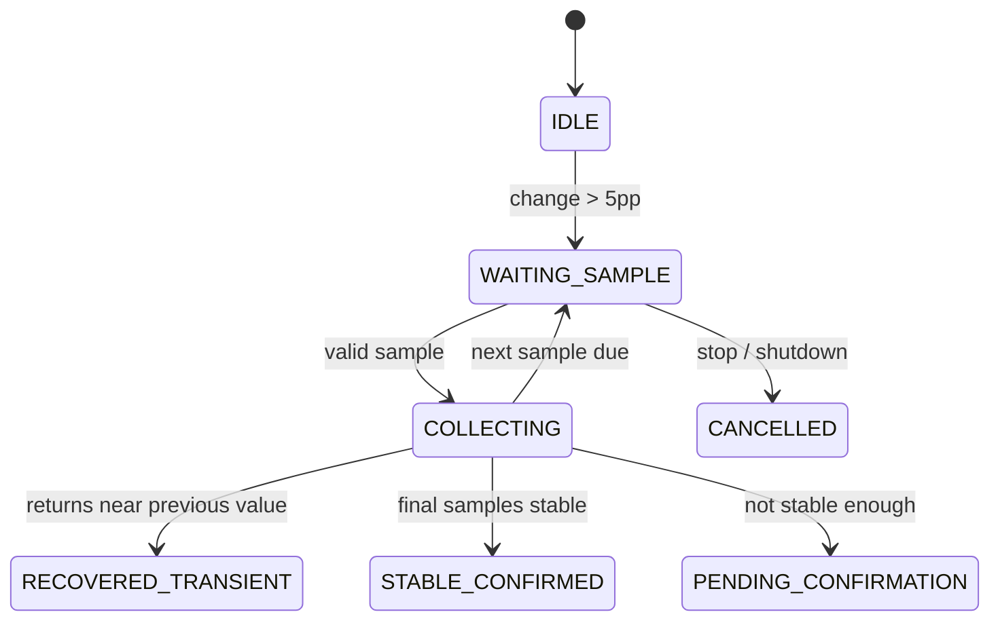

# Engineering Evolution

このプロジェクトで最も大きかった学びは、画像処理ロジックよりも **状態・I/O・並行処理の境界** がシステム安定性に強く影響することでした。

## 1. UI refresh caused extra camera access

### Symptom

ページ切替や自動 refresh が実カメラへの新規取得につながり、正式測定と UI 操作が同じ camera resource を取り合う状態がありました。

### Change

- acquisition API を統一
- shared/latest frame store を公開境界にする
- 通常 UI refresh は cache-only
- 明示的な manual refresh のみ active acquisition
- acquisition purpose と priority を導入

### Result

UI と measurement の責務を分離し、camera I/O の入口を一箇所に限定しました。

---

## 2. Blocking protection occupied workers

### Symptom

材料の急変を数分おきに再確認する機能を一つの worker 内で待機させると、長時間 worker を占有します。

### Change

Protection を pure state machine と durable session に分離しました。

`next_due_at` 到達時だけ scheduler が 1 回分の sample を実行し、待ち時間中は worker を解放します。

---

## 3. Confidence collapsed when material decreased

### Symptom

実際の開発データでは、材料を大きく減らしたときに remaining と同時に confidence まで急落する現象がありました。

### Root cause

Sparse mask に対する detector IoU が材料量に依存していたため、quality score と business quantity が結合していました。

### Change

- remaining を confidence の入力から排除
- fixed baseline support 上の detector agreement に変更
- validity / quality / decision を分離
- 100 / 80 / 50 / 20% remaining の quantity-neutral regression matrix を追加

この問題が AI-06 の直接の背景です。

---

## 4. Measurement fields could be semantically mixed

### Risk

Dashboard が `remaining = last accepted`、`confidence = latest attempt` のように別 measurement 由来の値を一つの「現在値」に見せると、表示自体はもっともらしくても record identity が壊れます。

### Change

current accepted state は一つの measurement row から serialization し、latest attempt は diagnostic として別 object に分けました。

---

## 5. Baseline registration crossed filesystem and DB

### Risk

Baseline image の保存だけ成功し DB が失敗する、または DB が更新された後に filesystem promotion が失敗すると half-registered state が残ります。

### Change

- staged filesystem output
- DB registration / provenance / initial measurement を transaction boundary に統合
- promotion failure cleanup
- one-active-baseline unique constraint

これを AI-05 として固定しました。

---

## 6. Protection restart crash window

Final architecture audit では、protection sample の capture row と session progress が別 transaction だったため、両者の間で process が終了すると restart 後に同じ sequence を再実行する crash window が見つかりました。

最終版では **capture + durable protection progress** を同じ SQLite transaction に入れ、失敗した in-memory mirror も破棄して durable state から再構築するようにしています。

---

## 7. From feature fixes to architecture guardrails

個別バグを都度修正するだけでは同じ種類の問題が別経路から再発するため、最後は 8 個の Architecture Invariants に整理しました。

このプロジェクトの後半は「機能を増やす」よりも、**違反状態を作れない境界を設計する**ことに重点を移しています。
