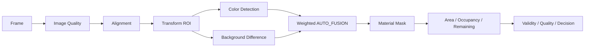

# Vision & Measurement Design

## 1. Measurement scope

このプロトタイプの基本前提は **fixed camera + manually defined ROI** です。材料を画像全体から自動分類するのではなく、利用者が監視対象領域を一度設定し、その領域内で残量変化を追跡します。

`remaining_ratio` は Baseline 登録時を 1.0 とした相対量です。

```text
remaining_ratio = current_material_area / baseline_material_area
```

ただし実装では位置補正後の ROI / mask と validity 判定を経て正式値を作ります。

## 2. Processing flow



## 3. Image quality

画像品質では、少なくとも次を判定します。

- underexposure
- overexposure / saturation
- blur

Sharpness は Laplacian variance、明るさは grayscale statistics を使用し、Baseline と比較した sharpness ratio も評価します。

## 4. Alignment

カメラ位置の小さな変化に対して、ORB feature + RANSAC による affine transformation を推定します。

- 小さなずれ: `CORRECTED`
- ほぼ同位置: `OK`
- 大きな shift / rotation / scale change: `FAILED`

材料自体は増減するため、可能な場合は ROI 外の背景特徴を優先して alignment に使用します。

## 5. AUTO_FUSION

新規 ROI は、利用者がアルゴリズム名を直接選ぶ方式ではなく、材料の色特性と環境条件から COLOR と BACKGROUND_DIFF の weight を決める `AUTO_FUSION` を使います。

Baseline 登録時は COLOR mask を基準材料領域として作成し、通常測定時の background difference はその baseline material support を主に使います。

材料補充によって Baseline mask の外側に新たな対象色が現れた場合も、色一致と reference からの変化を組み合わせて replenishment candidate として扱える構造です。

## 6. Why confidence was redesigned

初期の融合では detector mask の IoU を confidence の一部に使っていました。しかし材料が少なくなると mask の union 自体が小さくなり、同じ絶対誤差でも IoU が大きく悪化します。

つまり、

```text
material quantity decreases
        ↓
mask becomes sparse
        ↓
IoU becomes more sensitive
        ↓
confidence decreases
```

という誤った coupling が発生しました。

最終版では、COLOR と BACKGROUND_DIFF の一致度を **Baseline 時に固定された material support** 上で比較します。材料が取り除かれて両 detector が 0/0 と判断した画素も agreement として扱うため、denominator は残量と一緒に縮みません。

この変更は Architecture Invariant **AI-06 Remaining / Confidence Orthogonality** に固定しました。

## 7. Validity / quality / decision separation

最終版では次の概念を分離しています。

- **Validity**: この画像から業務量を測ってよいか
- **Quality**: 画像・alignment・detector の品質診断
- **Decision**: 正式値として採用するか、protection に回すか等
- **Confidence**: 測定品質の連続的な diagnostic score

低 confidence だけを理由に材料量を invalid にする設計から離し、quantity と quality の意味を混ぜないようにしています。
